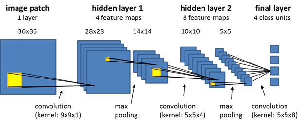
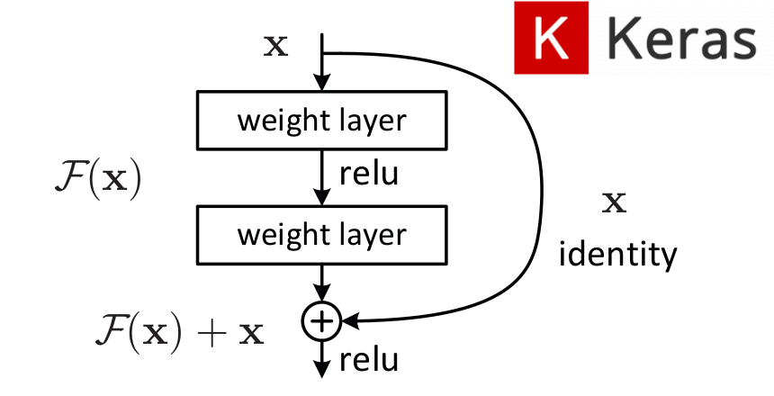
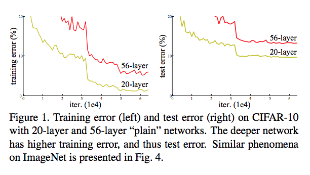

# Residual neural network
Residual nerual network, ook wel ResNets genoemd. Zijn artificele neurale netwerken die de zelfde patroon als .
In de wereld van AI is dit een redelijk nieuwe technologie dat geintroduceerd werd in 2015 door Kaiming He, Xiangyu.

## Verschil ResNet vs CNN
Het grote verschil tussen ResNets en CNN is hoe de connecties tussen de lagen zijn opgebouwd. 
Op Afbeelding 1 zie je hoe een basis netwerk is opgebouwd. Deze lagen worden sequentieel stap voor stap gedaan.
Op Afbeelding 2 zie je hoe 2 layers overgeslagen worden door een ResNet netwerk.

Afbeelding 1

Afbeelding 2

Het grote verschil is de connectie die de lagen overslaat en meeneemt in de activatie functie. Er is een aanzienlijk
groot verschil tussen de hoeveelheid lagen die nodig zijn om dezelfde/betere error% heeft dan originele neural networks.
(afbeelding hieronder)

