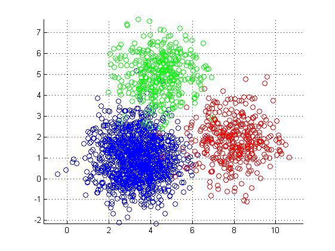
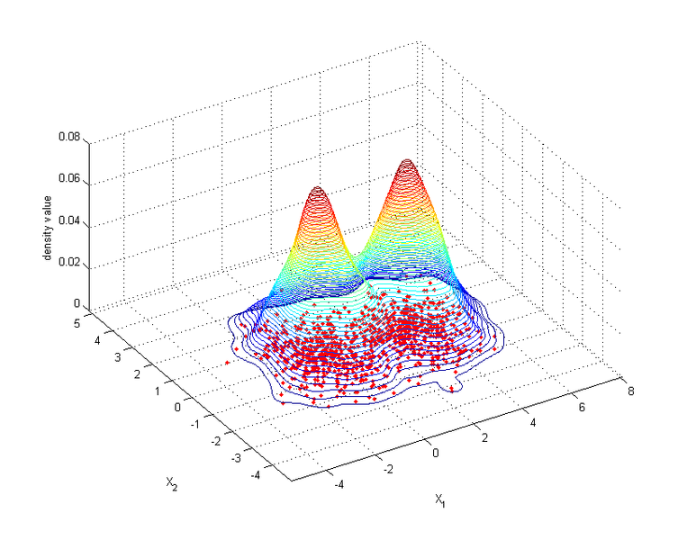
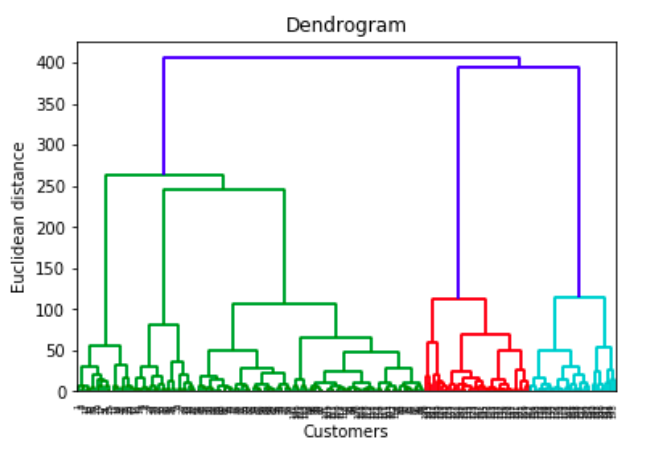

# Clustering
Clustering is een techniek die veel gebruikt wordt voor unsupervised learning in machine learning.
Met bijna alle machine learning technieken probeer je gegeven data te onderscheiden om een voorspelling te maken.
Als voorbeeld: Of het gaat regenen aan de hand van data over bewolking, wind en luchtdruk. Hieruit kan je snel een 
conclusie trekken dat, als het niet bewolkt is kan het ook niet regenen.

## Clustering algemeen
Zoals al verteld probeert clustering bepaalde groepen te bepalen uit gegeven data. Deze groepen worden opgesplitst en
kunnen daarna gebruikt worden met voorspellingen als bepaalde waardes gegeven zijn.

Zoals je ziet op de foto hierboven zie je drie duidelijke clusters. Voor machine learning is het belangrijk om waardes
in de grote groepen 
## Methodes
Hier worden verschillende bekende clustering methoden besproken om inzicht te krijgen voor clustering in het algemeen.
Omdat er veel verschillende zijn heb ik het bij 3 gehouden.
### K means
De K means algoritme heeft drie stappen. De eerste stap in de initiele "middelpunten" vinden van de clusters.
Daarna worden twee stappen herhaald. 
1. De dichtstbijzijnde punten worden toegevoegd aan de clusters.
2. De "middelpunten" worden vervangen door nieuwe middelpunten.

Het resultaat ziet er ongeveer uit als de foto genoemd bij _Clustering algemeen_
### Mean Shift
Met Mean Shift worden twee technieken gebruikt, KDE en Mean Shift zelf. Als je 

Mean Shift maakt hier gebruik van om de data naar elkaar toe te schuiven. Zoals je hier in de gif hieronder ziet.

### Hierarchical Clustering
Hierarchical Clustering start met het zien van alle datapunten als gelijke clusters. Hierna worden de dichtstbijzijnde
clusters bij elkaar toegevoegd. Dit proces herhaalt zich totdat een grote cluster ontstaat. Als dit visueel getoond
wordt kan de correlatie tussen grote/kleine groepen data goed gezien worden.

## Literatuur
Voor meer informatie over clustering methoden zelf:
https://scikit-learn.org/stable/modules/clustering.html